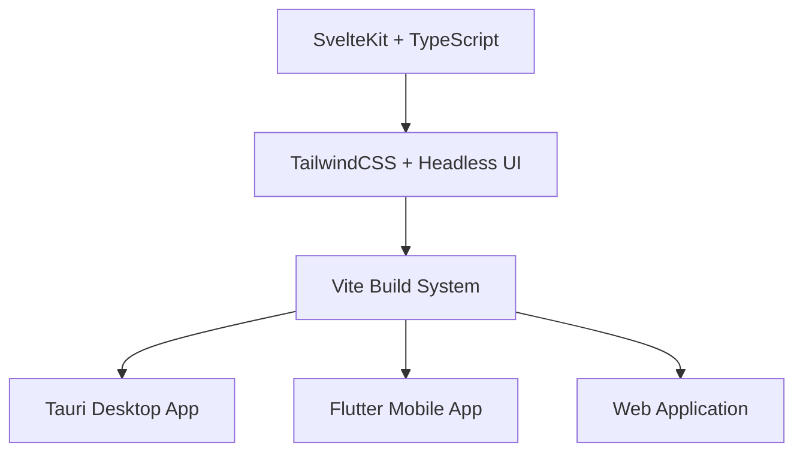
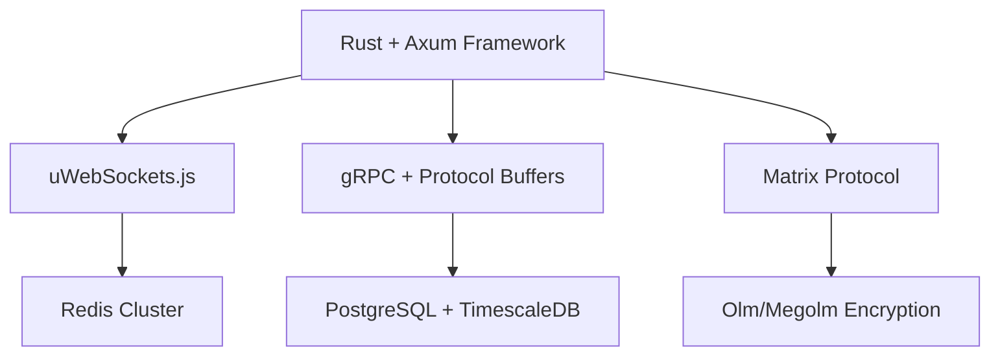

# AAEConnect - System Architecture

## Architecture Overview
AAEConnect employs a modern, high-performance microservices architecture optimized for enterprise communication with sub-25ms latency and 1000+ concurrent user support.

## Technology Stack Architecture

### Frontend Layer


### Backend Layer


## Microservices Architecture

### Core Services
1. **Authentication Service** (Rust + Axum)
   - PASETO token management
   - LDAP/AD integration
   - Session management with Redis

2. **Message Service** (Rust + uWebSockets.js)
   - Real-time messaging with <25ms latency
   - Message persistence and retrieval
   - End-to-end encryption with Matrix Protocol

3. **File Service** (Rust + MinIO)
   - File upload/download with <500ms initiation
   - Distributed storage with encryption
   - CAD file handling and annotation

4. **User Service** (Rust + Axum)
   - User profile management
   - AAE employee directory integration
   - Presence and status management

5. **Notification Service** (Rust + Axum)
   - Push notifications for mobile/desktop
   - Email notifications and alerts
   - Multi-channel notification delivery

### Supporting Services
6. **Search Service** (Rust + Elasticsearch)
   - Message and file search <50ms
   - AI-powered semantic search
   - Full-text indexing and retrieval

7. **Analytics Service** (Rust + TimescaleDB)
   - Real-time performance metrics
   - User behavior analysis
   - Business intelligence reporting

8. **Integration Service** (Rust + gRPC)
   - Google/Outlook calendar integration
   - AAE ERP system connectivity
   - Third-party service coordination

## Database Architecture

### Primary Database: PostgreSQL + TimescaleDB
```sql
-- Core Tables
CREATE TABLE users (
    id UUID PRIMARY KEY DEFAULT gen_random_uuid(),
    username VARCHAR(50) UNIQUE NOT NULL,
    email VARCHAR(255) UNIQUE NOT NULL,
    password_hash VARCHAR(255) NOT NULL,
    aae_employee_id VARCHAR(20),
    department VARCHAR(100),
    position VARCHAR(100),
    created_at TIMESTAMPTZ DEFAULT NOW(),
    updated_at TIMESTAMPTZ DEFAULT NOW()
);

CREATE TABLE rooms (
    id UUID PRIMARY KEY DEFAULT gen_random_uuid(),
    name VARCHAR(255) NOT NULL,
    type VARCHAR(20) DEFAULT 'group', -- 'direct', 'group', 'channel'
    is_encrypted BOOLEAN DEFAULT true,
    aae_department VARCHAR(100),
    created_at TIMESTAMPTZ DEFAULT NOW()
);

CREATE TABLE messages (
    id UUID PRIMARY KEY DEFAULT gen_random_uuid(),
    room_id UUID NOT NULL REFERENCES rooms(id),
    user_id UUID NOT NULL REFERENCES users(id),
    content TEXT NOT NULL,
    message_type VARCHAR(20) DEFAULT 'text',
    encrypted_content BYTEA,
    created_at TIMESTAMPTZ DEFAULT NOW()
);

-- TimescaleDB hypertables for time-series data
SELECT create_hypertable('messages', 'created_at');
SELECT create_hypertable('user_activity', 'timestamp');
SELECT create_hypertable('performance_metrics', 'timestamp');
```

### Caching Layer: Redis Cluster
```redis
# Session Management
SET session:{token} "{user_id, expires_at, permissions}" EX 86400

# Message Caching (recent messages)
ZADD room:{room_id}:messages {timestamp} {message_id}

# User Presence
SET user:{user_id}:presence "{status, last_seen}" EX 300

# Performance Metrics Cache
SET metrics:{service}:{timestamp} "{latency, throughput, errors}"
```

## Security Architecture

### Encryption Layer
```rust
// Matrix Protocol Implementation
use matrix_sdk::{Client, config::SyncSettings};
use ruma::events::room::message::RoomMessageEventContent;

// End-to-End Encryption with Olm/Megolm
- Device verification and cross-signing
- Automatic key backup and recovery
- Forward secrecy with message keys
- Audit trail for all cryptographic operations
```

### Authentication Flow
1. **LDAP/AD Authentication**: Employee credentials verification
2. **PASETO Token Generation**: Secure, purpose-built tokens
3. **Matrix Device Registration**: E2E encryption setup
4. **Session Management**: Redis-based session storage

## Performance Architecture

### Latency Optimization
- **WebSocket Connections**: Persistent connections for <25ms messaging
- **Connection Pooling**: Efficient database and Redis connections
- **Edge Caching**: Strategic content caching for fast delivery
- **Protocol Optimization**: HTTP/3, gRPC, and WebSocket optimization

### Scalability Design
- **Horizontal Scaling**: Kubernetes-based service scaling
- **Load Balancing**: Intelligent traffic distribution
- **Database Sharding**: Partition strategies for large datasets
- **Caching Strategies**: Multi-level caching for performance

## Deployment Architecture

### Container Orchestration
```yaml
# Kubernetes Deployment Structure
apiVersion: apps/v1
kind: Deployment
metadata:
  name: aaeconnect-message-service
spec:
  replicas: 3
  selector:
    matchLabels:
      app: message-service
  template:
    spec:
      containers:
      - name: message-service
        image: aaeconnect/message-service:latest
        resources:
          requests:
            memory: "64Mi"
            cpu: "250m"
          limits:
            memory: "128Mi"
            cpu: "500m"
```

### Infrastructure Components
- **Kubernetes Cluster**: Container orchestration and scaling
- **NGINX Ingress**: Load balancing and SSL termination
- **Prometheus + Grafana**: Monitoring and alerting
- **MinIO Cluster**: Distributed object storage
- **Redis Cluster**: High-availability caching

## Network Architecture

### Communication Protocols
- **WebSocket**: Real-time bidirectional communication
- **gRPC**: High-performance service-to-service communication
- **HTTP/3**: Optimized web protocol with QUIC
- **TLS 1.3**: Enhanced transport layer security

### Network Optimization
- **Connection Pooling**: Reuse connections for efficiency
- **Compression**: Intelligent message and file compression
- **CDN Integration**: Content delivery optimization
- **QoS Management**: Quality of service prioritization

## Monitoring and Observability

### Metrics Collection
- **Application Metrics**: Custom business and performance metrics
- **Infrastructure Metrics**: System resource utilization
- **Network Metrics**: Latency, throughput, and error rates
- **Security Metrics**: Authentication, authorization, and threat detection

### Logging Strategy
- **Structured Logging**: JSON-formatted logs for analysis
- **Centralized Logging**: ELK stack for log aggregation
- **Audit Logging**: Compliance and security audit trails
- **Performance Logging**: Detailed performance trace data

This architecture ensures AAEConnect meets all performance targets while maintaining enterprise-grade security and scalability for AAE's communication needs.